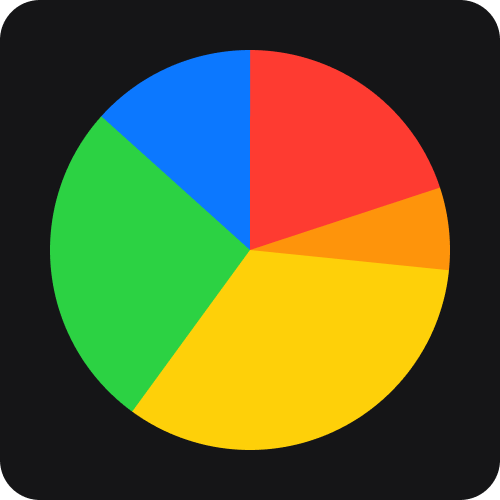

# ApplePie charts

This package creates pie and donut charts for user-understandable representation of your data. Written in Swift using SwiftUI and CoreGraphics frameworks.

 


## Why ApplePie?

- Simple SwiftUI-like syntax
- Lightweight and fast
- Formatted documentation with step-by-step guide how to create your charts

## Installation

### Swift Package Manager

In Xcode follow `File -> Add Package Dependencies`, then paste the [link](https://github.com/PinkXaciD/ApplePie) to this repo.

## Usage

### Overview

Import ApplePie into your application.

```swift
import ApplePie
```

Then add `APChart` to your view.

```swift
APChart {
    // Your data
}
```

### Example

Let's say you have a collection of bakeries and you want to show how many apple pies each one has in stock.

```swift
struct Bakery {
    let name: String
    let pieCount: Double
    let color: Color
}

let bakeries: [Bakery] = [
    .init(name: "Bakery 1", pieCount: 3, color: .red),
    .init(name: "Bakery 2", pieCount: 1, color: .orange),
    .init(name: "Bakery 3", pieCount: 5, color: .yellow),
    .init(name: "Bakery 4", pieCount: 4, color: .green),
    .init(name: "Bakery 5", pieCount: 2, color: .blue)
]
```

You will need to convert your data into array of chart sector data with value and fill color.

```swift
APChart {
    bakeries.map { APChartSectorData($0.pieCount, $0.color) }
}
```



Then you can customize it: add inner radius and/or separators.

```swift
APChart(
    separators: 0.5, 
    innerRadius: 0.7
) {...}
```


Finally you can customize the appearance effect of your chart with the `.appearanceEffect` modifier.

```swift
APChart(...) {...}
    .appearanceEffect(effect: .rotate, animation: .smooth)
```

## Documentation

This package has buit-in [DocC](https://www.swift.org/documentation/docc/) documentation, to build it in Xcode go to `Product -> Build Documentation` (or press `Control+Command+Shift+D`).
